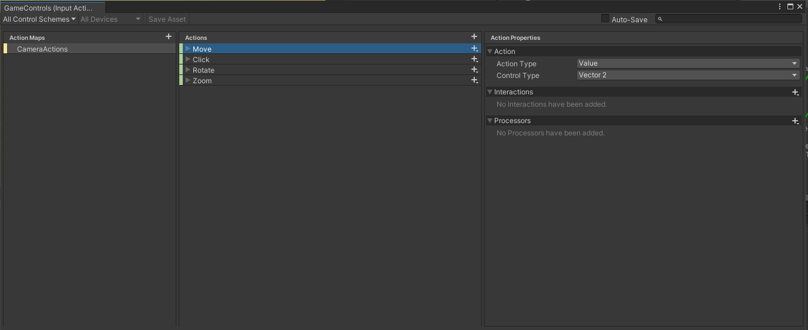
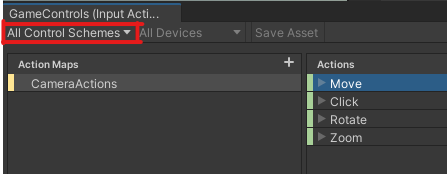
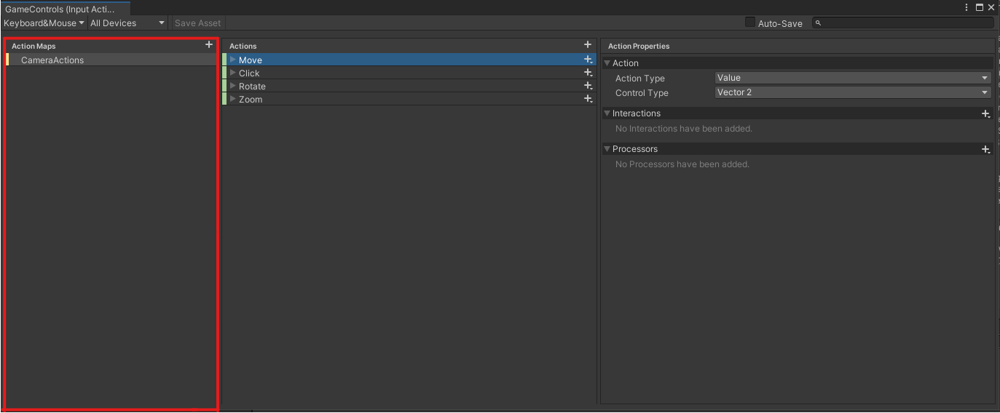
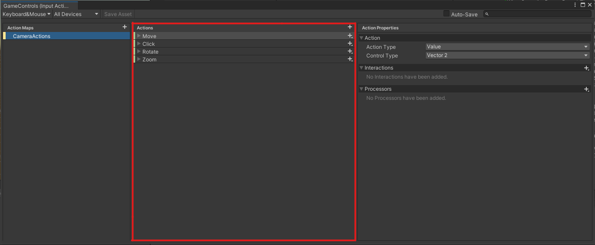
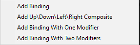

Управляющие сигналы от устройств ввода надо настраивать, используя новую инпут-систему Unity. 
## Файл настроек
Чтобы добавить новый сигнал для инпут-системы или отредактировать имеющиеся, необходимо зайти через редактор Unity в Assets/Settings/GameControls.inputactions. Перед пользователем откроется следующее окно:

Желательно сразу же в списке control schemes поставить используемую в игре схему KeyboardMouse:

Рассмотрим каждую колонку в окне настроек. Первая колонка с заголовком **Action Maps** - это, скажем так, область действий инпута.

Пока что там присутствуют только группа сигналов для управления камерой. В будущем почти наверняка появятся всякие хоткеи, кнопки вызова менюшек и прочее. Соответственно, если вам нужно добавить, например, кнопку вызова главного меню - надо создать новый ActionMap через кнопку плюсика в правом верхнем углу колонки.

Далее рассмотрим колонку **Actions**:

Здесь перечислены сами действия, которые мы хотим выполнять при помощи инпут-системы. Для камеры сейчас есть четыре действия:
- _Move_ - перемещение камеры по плоскости
- _Click_ - клик по игровым объектом
- _Rotate_ - вращение камеры по сфере с центром в точке центра экрана
- _Zoom_ - приближение/отдаление камеры

Раскрывая каждое действие, можно увидеть, при помощи каких сигналов вызывается то или иное действие:

Сразу видно, что движение осуществляется через WASD и стрелочки, клики - левой кнопкой мыши, вращение через комбинацию, а зум - колесиком. Еще более подробную информацию можно выяснить, если раскрыть каждое из составных действий:

Что все это значит? У нас есть некое действие, которое мы хотим совершить при помощи клавамыши. Для этого мы должны добавить это действие в список этих самых действий в колонку **Actions**, а после можем добавить, с помощью каких именно сигналов оно будет производиться. Когда мы хотим добавить новую комбинацию клавиш, нам предлагают следующие варианты:

 

- Binding - использование одной какой-то клавиши или кнопки мыши, либо использование движения мыши.
- Positive/Negative Binding - использование двух кнопок для отображения действия, выполняемого вдоль одной оси (например вперед/назад)
- Up/Down/Left/Right Composite - использование четырех кнопок для отображения действия, изменяемого в четырех направлениях, классический пример движение через WASD
- Binding With One Modifier - действие через два одновременных сигнала, например, Ctrl+C
- Binding With Two Modifiers - действие через три одновременных сигнала, например, Ctrl+Shift+C

 Самое главное, что нужно понимать при задании binding - это в каком виде нам удобно получать сигнал от инпут-системы? Настраивается это в третьей колонке данного конфига:

 
Как понятно из навания в третьей колонке прописываются свойства действия или привязки клавиши. Например в ActionProperties мы задаем тип воздействия и тип переменной, в которую преобразуется данный сигнал. 

Таким образом действие Move, осуществляемое через WASD и стрелочки, удобнее всего получать в виде 2D-вектора, а клик - как событие нажатия кнопки.

Через Binding Properties же мы как раз задаем параметры, через которые наше действие будет выполняться, т.е. прописываем конкретные клавиши клавиатуры или изменения мыши. Через эти же настройки мы задаем, какой сигнал является сигналом, а какой - просто модификатором. Там же, в Interactions, задается какое именно действие с кнопкой, например, мы хотим совершить - нажать, зажать на время, нажать несколько раз и тд.